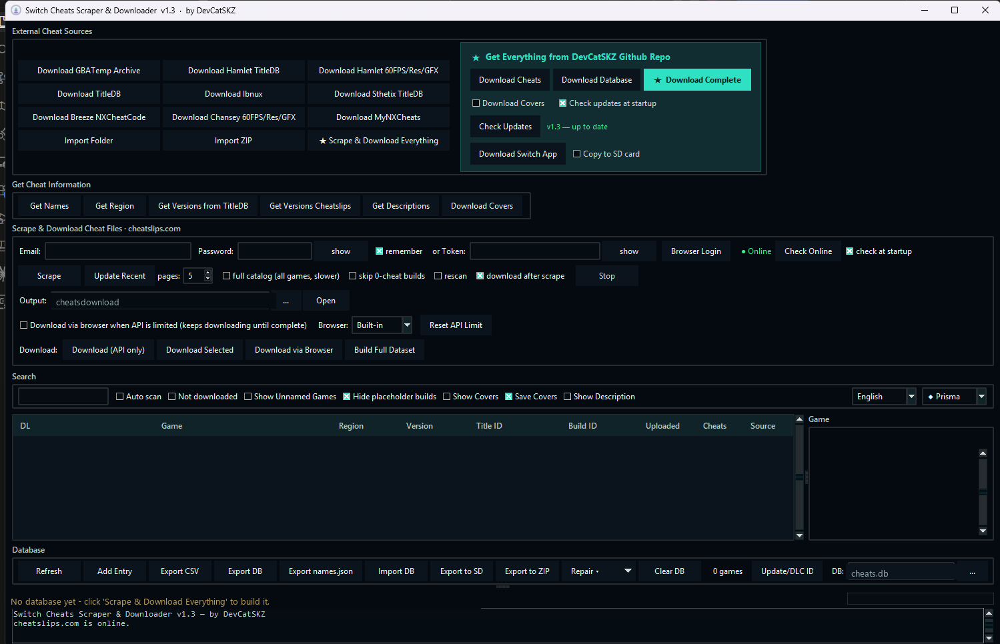
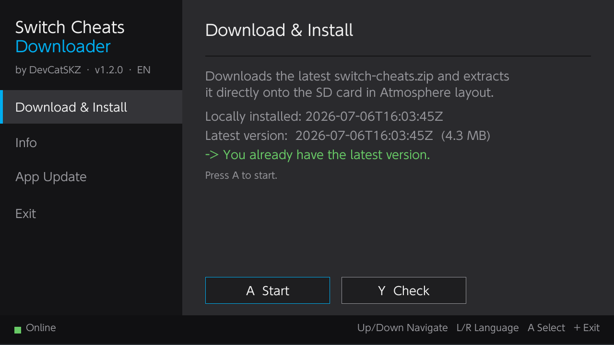
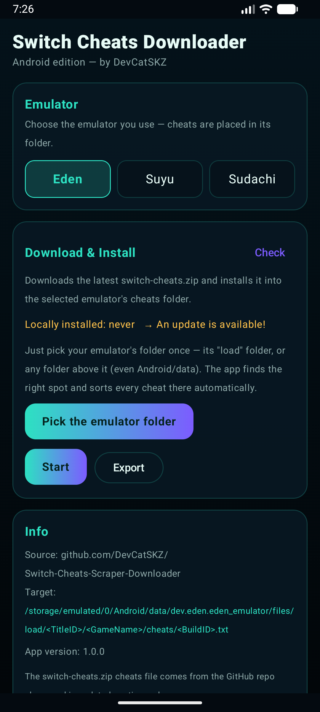

<p align="center">
  
</p>

<p align="center">
  
  
  
  
  
  
</p>

<p align="center"><b>Autor: DevCatSKZ</b></p>

<p align="center"><a href="README.md">🇬🇧 English</a> · <b>🇩🇪 Deutsch</b></p>

Ein Tool, um Nintendo-Switch-Cheatcodes von **[CheatSlips.com](https://www.cheatslips.com), GBATempArchive, HamletDuFromage, Sthetix, Breeze (NXCheatCode), ChanseyIsTheBest (60FPS/Res/GFX), MyNXCheats, ibnux und titledb** zu **scrapen und herunterzuladen**, sie in einer **durchsuchbaren SQLite-Datenbank** (Namen, Cover, Regionen, Versionen, Beschreibungen) zu **verwalten** und direkt in die passende Struktur auf die **Switch-SD-Karte** (Atmosphère / Breeze / EdiZon) – oder als ZIP – zu exportieren.

> Nutze das Tool nur mit deinem **eigenen** CheatSlips-Account. Alle Cheat-Codes gehören ihren ursprünglichen Autoren/Uploadern.

<p align="center"></p>

## ⬇️ Download (Windows)

Fertige Builds gibt es unter **[Releases](../../releases/latest)**:

| Variante | Beschreibung |
|---|---|
| **Installer** (`SwitchCheatsScraper-Setup.exe`) | Klassische Installation (pro Benutzer, mit Start-/Desktop-Verknüpfung). |
| **Portable** (`SwitchCheatsScraper-portable.zip`) | Entpacken und `SwitchCheatsScraper.exe` starten — keine Installation nötig. Daten liegen **neben der EXE**. |

Es ist **kein** Python nötig — die EXE ist eigenständig. (Der Playwright-Browser für den optionalen Browser-Download wird beim ersten Gebrauch automatisch geladen.)

## 🎮 Switch-App (Homebrew)

Zum Desktop-Tool gibt es ein **Gegenstück, das direkt auf der Switch läuft**: eine eigenständige Homebrew-App (`SwitchCheatsDownloader.nro`), die das stets aktuelle [`data`-Release](https://github.com/DevCatSKZ/Switch-Cheats-Scraper-Downloader/releases/tag/data) **auf der Konsole** lädt und direkt im Atmosphère-Format auf die SD-Karte entpackt — ganz ohne PC.

<p align="center"></p>

**Was sie macht:** Beim Start prüft sie, ob neue Cheats verfügbar sind (dieselbe Erkennung „erneuter Upload ohne Versionssprung“ wie das Desktop-Tool, inkl. Download-Größe). Ein Druck auf **A** lädt und entpackt alles nach `atmosphere/contents/<TitleID>/cheats/`. Abgebrochene Downloads werden **fortgesetzt**, die App kann sich **selbst aktualisieren**, und die Oberfläche spricht **6 Sprachen** (EN/DE/ES/FR/IT/JA, automatisch von der Konsole erkannt) — bedienbar per Joy-Con **und** Touch.

**Installation:** Lade [`SwitchCheatsDownloader-Switch.zip`](../../releases/latest) aus dem neuesten Release und entpacke es ins **Hauptverzeichnis deiner SD-Karte** (enthält `switch/SwitchCheatsDownloader.nro`). Starte dann *Switch Cheats Downloader* aus dem Homebrew-Menü. Voraussetzung: eine modifizierte Switch (Atmosphère + hbmenu) und WLAN.

Quellcode & Entwickler-Doku: [`SwitchCheatsNRO/`](SwitchCheatsNRO/) — mit devkitPro bauen, siehe die [README](SwitchCheatsNRO/README.md).

## 🤖 Android-App (Emulatoren)

Derselbe Downloader läuft auch auf **Android**, für die Switch-Emulatoren **Eden, Suyu und Sudachi** (`SwitchCheatsDownloader-Android.apk`). Er holt das stets aktuelle [`data`-Release](https://github.com/DevCatSKZ/Switch-Cheats-Scraper-Downloader/releases/tag/data) **auf dem Handy** und schreibt die Cheats direkt in die load-Struktur des Emulators — ganz ohne PC.

<p align="center"></p>

**Was sie macht:** Wähle deinen Emulator und tippe auf **Starten** — die App lädt alle Cheats und schreibt sie in den load-Ordner des Emulators als `.../load/<TitleID>/<Spielname>/cheats/<BuildID>.txt`. Jeder Ordner wird nach dem echten Spielnamen benannt (aus der `names.json` im `data`-Release; als Rückfall die Title-ID). Abgebrochene Downloads werden **fortgesetzt**, die App prüft dieses Repo auf **Updates** (eine neuere APK *und* frische Cheats, gleiche Erkennung wie im Desktop-Tool), zeigt den Online-Status live an und spricht dieselben **6 Sprachen** (EN/DE/ES/FR/IT/JA, automatisch erkannt). Gleicher **Holo-Glass**-Look wie die Windows- und Switch-App.

**Speicher:** Beim ersten Start fragt die App einmalig nach „**Zugriff auf alle Dateien**“ (`MANAGE_EXTERNAL_STORAGE`), um in die Emulator-Ordner schreiben zu können. Wo das Betriebssystem ein direktes Schreiben blockiert (fremder `Android/data/…`-Ordner ab Android 11), springt sie auf eine **einmalige Ordnerwahl** um — schon zum Emulator-Ordner vor-navigiert — und arbeitet danach automatisch weiter. Ein **Export in einen Ordner deiner Wahl** ist jederzeit möglich.

**Installation:** Lade [`SwitchCheatsDownloader-Android.apk`](../../releases/latest) aus dem neuesten Release, erlaube die Installation aus unbekannten Quellen und erteile beim ersten Start „**Zugriff auf alle Dateien**“. Voraussetzung: Android 8.0 (API 26)+.

Quellcode & Entwickler-Doku: [`SwitchCheatsAndroid/`](SwitchCheatsAndroid/) — mit Gradle bauen (`gradlew assembleRelease`), siehe die [README](SwitchCheatsAndroid/README.md).

## 📦 Immer aktuelle Cheats & Datenbank

Du musst nichts selbst scrapen: Ein **laufend aktualisiertes** Cheat-Archiv und die komplette GUI-Datenbank liegen im **[`data`-Release](https://github.com/DevCatSKZ/Switch-Cheats-Scraper-Downloader/releases/tag/data)** des Repos. Sobald neue Cheats dazukommen, werden diese Dateien aktualisiert — du bekommst also immer den **neuesten** Stand.

| Datei | Was es ist | Direktlink |
|---|---|---|
| `switch-cheats.zip` | Alle Cheat-Dateien (Atmosphère-Format) | [Download](https://github.com/DevCatSKZ/Switch-Cheats-Scraper-Downloader/releases/download/data/switch-cheats.zip) |
| `database.db` | Komplette GUI-Datenbank (Namen, Regionen, Versionen, Beschreibungen, Cover-**URLs**) | [Download](https://github.com/DevCatSKZ/Switch-Cheats-Scraper-Downloader/releases/download/data/database.db) |
| `names.json` | Title-ID → Spielname (benennt die Cheat-Ordner der Android-App) | [Download](https://github.com/DevCatSKZ/Switch-Cheats-Scraper-Downloader/releases/download/data/names.json) |

In der App holt die Karte **★ Alles von DevCatSKZ holen** diese Dateien mit einem Klick, und **Nach Updates suchen** erkennt, wenn sie aktualisiert wurden, und importiert sie neu — nichts wird entfernt, vorhandene Einträge werden zusammengeführt und ergänzt.

## ✨ Highlights

- **Alles von DevCatSKZ mit einem Klick** — komplett ohne Scrapen: lade das fertige Cheat-Archiv und die vollständige Datenbank des Maintainers direkt von GitHub (die Datenbank enthält nur Cover-*URLs*, niemals Cover-Bilder).
- **Viele Cheat-Quellen** in einem Tool: cheatslips.com (Scrape + offizielle API), GBATempArchive, HamletDuFromage, Sthetix, Breeze, Chansey (60 FPS/Res/GFX), MyNXCheats, ibnux, titledb.
- **Ein-Klick-Komplettdatensatz** (★ Scrape & Download Everything) und gezielte Einzelaktionen.
- **SD-Karten-Export** (Auto-Erkennung des Laufwerks) und **ZIP-Export/-Import** in exakt der Struktur, die Atmosphère/Breeze/EdiZon erwarten.
- **Robuster Browser-Fallback** (Playwright) für Cheats, die die API nicht liefert, inkl. automatischem Login-Handling und Quota-Reset.
- **Durchsuchbare Datenbank-GUI** mit Cover-Anzeige, Regionen, Versionen, Beschreibungen und Live-Disk-Abgleich.
- **Dark Mode als Standard**, mit Ein-Klick-Umschalter zwischen Hell und Dunkel — wirkt auf das **komplette Programm**: Hauptfenster, Tabelle, Detail-Panel, Log, Menüs und **alle Unterfenster**. Die Auswahl bleibt zwischen den Läufen erhalten.

## Features

- **`metadata`**: Sammelt alle Spiele, Title-IDs, Build-IDs, **Version**, **Upload-Datum**, **Cheat-Anzahl** und Cheat-Namen – **ohne Login** – und pflegt zusätzlich eine **SQLite-Datenbank** (`cheats.db`).
- **`db`**: Durchsucht und zeigt die gepflegte Datenbank an (Spielname, Version, Title-ID, Build-ID, Upload-Datum, Cheat-Anzahl).
- **`gui`**: Grafische Oberfläche mit nach Arbeitsablauf gruppierter Toolbar und durchsuchbarer **Datenbank-Anzeige**.
- **`download`**: Lädt die **vollständigen Cheat-Code-Dateien** über die **offizielle API** herunter (`X-API-TOKEN`) — **kein Browser, kein reCAPTCHA**. Token wird aus E-Mail/Passwort geholt oder direkt angegeben.
- Speichert die Ausgabe im Switch-Atmosphere-Format:
  ```
  titles/{TITLE_ID}/cheats/{BUILD_ID}.txt
  ```
- **Viele Cheat-Quellen**: cheatslips.com (Scrape + API) plus externe Archive — **GBATempArchive, HamletDuFromage** (`titles_complete.zip`), **HamletDuFromage 60FPS/Res/GFX**, **Sthetix** (tägliches Aggregat, ~141k Cheats), **Breeze/NXCheatCode**, **Chansey 60FPS/Res/GFX** (Live-Repo), **MyNXCheats** (Live-Repo), **ibnux** und **titledb** `cheats.json`. Die Spalte **Source** zeigt pro Build, woher die Cheats stammen; Cheats werden pro Build **gemergt** (Duplikate gehen nie verloren), und codelose **Stub-Dateien** (nur Namen/Werbung) werden beim Import übersprungen.
- **Update Recent**: holt nur die neuesten „latest cheat codes"-Seiten von cheatslips, um neue/aktualisierte Cheats nachzuladen — ohne kompletten Rescan.
- **Zwei entkoppelte Scrape-Schalter** (in `settings.json` gespeichert):
  - **„full catalog (all games)"** (Default AN): Discovery über den kompletten Spielkatalog `/games`. Aus = schneller `/entry`-Feed (nur zuletzt hochgeladene Cheats).
  - **„skip 0-cheat builds"** (Default AUS): Wenn an, werden Builds mit 0 Cheats beim Scrapen verworfen. **Standardmäßig aus**, sodass **alle** gelisteten Builds in die DB kommen — auch solche, für die die API/HTML (vorübergehend) 0 Cheats meldet. Diese erscheinen unter dem Filter **„Not downloaded"**, statt unsichtbar zu fehlen. Beide Schalter sind unabhängig kombinierbar (z. B. schneller `/entry`-Feed **und** 0-Cheat behalten).
- **HTML-Cheat-Anzahl aus der „Game releases"-Tabelle**: Die Spalte „Available cheats" wird jetzt direkt ausgelesen, sodass ein Build seine echte Cheat-Zahl zeigt — auch wenn die API diesen Build nicht mitliefert (statt fälschlich 0).
- **0-Cheat-Schutz**: Ein erneuter Scrape, der für einen Build 0/keine Cheats liefert, überschreibt eine bereits bekannte (echte) Cheat-Anzahl **nicht** mehr.
- **Voll gepflegte SQLite-Datenbank** (`cheats.db`) mit allen Feldern: Name, Title-ID, Build-ID, Version, Upload-Datum, Cheat-Namen, Credits, Beschreibung, Cover-Bild, Banner, **Region** (US/EU/AU/JP/KR/HK/CN/Homebrew) und **Quelle**.
- **Metadaten-Anreicherung** über **einzeln aufrufbare Buttons** (Get Names / Get Region / Get Versions from TitleDB / Get Versions Cheatslips / Get Descriptions / Download Covers): Spielnamen + Cover aus allen titledb-Regionen, switchbrew, tinfoil.io, GitHub-Namenslisten und der CheatSlips-API; **Region**-Markierung mit mehreren Fallbacks (titledb → Basis-Spiel → switchbrew → Homebrew-Tag → Schrift-Heuristik); Versionen aus titledb bzw. cheatslips; Beschreibungen aus titledb.
- **Streaming-Scrape**: Detail-Scraping startet sofort, parallel zum Listen.
- **Disk-Abgleich**: zeigt, welche Builds schon heruntergeladen sind und welche fehlen. Ein **Datei-Cache** (`.scan_cache.json`, mtime+Größe je Datei) macht wiederholte Live-Scans um ein Vielfaches schneller (~5000 Dateien: von ~45 s auf ~1 s) — geänderte Dateien werden weiterhin neu geprüft.
- **Flüssige GUI auch bei großen Datenbanken**: Die Tabelle wird **asynchron** befüllt (DB-Abfrage + Disk-Scan im Hintergrund, Zeilen-Einfügen gebündelt) — kein Einfrieren mehr beim Refresh oder beim Tippen in der Suche. Die SQLite-DB läuft im **WAL-Modus** (paralleles Lesen/Schreiben ohne „database is locked") und hat einen **Index auf der Title-ID** für schnelle Anreicherungsläufe.
- **Robuster Browser-Fallback** für Cheats, die die API nicht liefert: löst jede Build-ID zur richtigen Cheat-Seite auf (Cheat-Karten **und** „Game releases"-Tabelle, inkl. Build-ID-Landing-Pages), setzt bei erreichtem Download-Limit automatisch das **Quota zurück** und versucht es erneut. **Neu:** Stößt der API-Download (auch der automatische nach *Scrape*/*Update Recent*) an die **Tages-Quota**, schaltet das Tool **automatisch auf den Browser-Download** für die restlichen Builds um — mit gespeichertem Login läuft das ohne weitere Eingabe. Nur der Button **„Download (API only)"** bleibt bewusst rein API-basiert.
- **„Unavailable"-Markierung**: Builds, die auf cheatslips nachweislich **keine Codes** haben (kein Cheat vorhanden oder codeloser Upload = nur Namen), werden markiert und in künftigen Läufen **übersprungen** (Liste in `unavailable_builds.txt`, zurücksetzbar über **Repair ▾ → „Retry 'unavailable' builds"**).
- **Export auf die Switch-SD-Karte**: Kopiert die heruntergeladenen Cheats direkt ins passende Format (**Atmosphère** `atmosphere/contents/<TID>/cheats/<BID>.txt`, **Breeze** oder **EdiZon SE**). Die SD-Karte wird per **Auto-detect** am Laufwerk erkannt; leere/Stub-Dateien werden übersprungen, vorhandene Karten-Cheats gemergt.
- **Export als ZIP** (und **Re-Import**): Dieselbe SD-Struktur in ein ZIP-Archiv packen (alle oder nur markierte Einträge) — zum späteren Entpacken auf die SD-Karte; auch per Rechtsklick-Kontextmenü für einzelne Cheats. Ein solches Archiv lässt sich per **„Import ZIP"** jederzeit wieder in die Datenbank einlesen.
- **Cheatslips-Online-Status**: farbige Anzeige (grün/rot), ob die Seite erreichbar ist — bei Programmstart automatisch (abschaltbar) und jederzeit per Button prüfbar.
- **Browser Login**: einmaliger cheatslips-Login im eingebetteten Browser; die Cookies werden dauerhaft gespeichert, sodass Browser-Downloads/Quota-Resets künftig automatisch eingeloggt sind.
- **Anreicherung wahlweise gezielt**: Die *Get*-Funktionen (Names/Region/Versionen/Beschreibungen) laufen über den Toolbar-Button für die ganze DB, per **Rechtsklick-Kontextmenü** aber nur für die **markierten** Einträge.
- **Fortschrittsbalken + Stop**, **CSV-Export**, **DB-Export** (komplette `cheats.db` sichern), **Package-Befehl** (ZIP für die SD-Karte).
- **Standard-Tastenkürzel** in allen Textfeldern (Strg+A markiert alles, Strg+C/X/V) und Vollbild-Unterstützung (**F11**, **Esc**, **Strg+M**), für Full-HD optimiert.

## Installation

Python 3.10+ ist erforderlich. Der **Standard-Download** läuft über die offizielle API (kein Browser). Für den **Browser-Download** (Cheats, die die API nicht liefert, + automatischer Quota-Reset) nutzt das Tool **Playwright** — bereits in `requirements.txt` enthalten.

```powershell
pip install -r requirements.txt
```

Die Playwright-**Browser (Chromium + Firefox) werden vom Programm automatisch installiert**, sobald ein Browser-Download zum ersten Mal genutzt wird — **du musst nichts weiter tun** (kein manuelles `playwright install`). Optional lassen sie sich auch vorab holen:

```powershell
playwright install chromium firefox
```

Im **Download-Bereich** kannst du über das Dropdown **„Browser:"** wählen, womit gearbeitet wird: **Built-in** (mitgeliefertes Chromium), **Chrome** (dein installierter Browser) oder **Firefox** (Playwrights Firefox).

## Wichtige Hinweise

- Der Standard-Download nutzt die **offizielle CheatSlips-API** (`https://www.cheatslips.com/api/v1`) — **kein Browser, kein reCAPTCHA**. Nur der optionale **Browser-Fallback** (für API-Lücken/Quota) öffnet ein Chromium-Fenster.
- CheatSlips-Cheats sind **build-spezifisch**: Es gibt nur Codes für genau die Build-IDs, für die jemand einen Cheat hochgeladen hat. Build-IDs ohne Upload (häufig bei Pokémon-Titeln/titledb-Versionen) oder **codelose Uploads** (nur Cheat-Namen) haben keine Codes und werden als *unavailable* markiert/übersprungen — das ist kein Fehler.
- Der Cheat-**Inhalt** ist token-pflichtig: Du brauchst ein **API-Token** (aus deinem CheatSlips-Account) oder gibst E-Mail+Passwort an, dann holt das Tool automatisch ein Token über `POST /token`.
- **Metadaten** (Spielname, Title-ID, Build-IDs, Cheat-Namen, Credits, Beschreibung, Cover) sind **ohne Token** verfügbar.
- Es gibt **keinen** „alle Spiele auflisten"-API-Endpunkt — die Discovery (Title-IDs) läuft weiter über das HTML der Seite (`metadata`/Scrape), die Inhalte dann über die API.

## Verwendung

### 1. Alle Spiele-Metadaten sammeln (kein Login)

```powershell
python scraper.py metadata --output ./metadata
```

Ergebnis:
- `metadata/metadata.json` – alle Spiele mit Title-IDs, Build-IDs, Version, Upload-Datum, Cheat-Anzahl und Cheat-Namen.
- `metadata/by_build_id.json` – flacher Index **sortiert nach Build-ID** (inkl. Version, Upload-Datum, Cheat-Anzahl).
- `cheats.db` – persistente **SQLite-Datenbank**, die bei jedem Lauf aktualisiert wird. Pfad mit `--db` änderbar.

### Datenbank durchsuchen / anzeigen

```powershell
# Alles anzeigen
python scraper.py db

# Nach Spielname suchen
python scraper.py db --search "final fantasy"

# Nach Build-ID oder Title-ID filtern
python scraper.py db --build-id 3CFD457814DD647F
python scraper.py db --title-id 010038B015560000
```

Ausgabe (Spalten): **Game | Version | Title ID | Build ID | Uploaded | Cheats**.

### Programm starten

```powershell
python SwitchCheatsScraper.py
```

Das ist der klare, einzige Start-Befehl. (Die alten Aufrufe `python gui.py` bzw. `python scraper.py gui` funktionieren weiterhin, sind aber nicht mehr nötig.)

**Als fertige Windows-EXE mit Installer:** Das Programm lässt sich zu einer eigenständigen `SwitchCheatsScraper.exe` (+ Setup-Installer) bauen — siehe **[BUILD.md](BUILD.md)** (`build.ps1` erledigt alles automatisch). Wird die App als EXE ausgeführt, speichert sie alle Daten (Datenbank, Downloads, Einstellungen, Login-Profil) **im selben Ordner wie die EXE** (portabel) — die App bleibt so mitsamt Daten kopierbar/verschiebbar. Nur falls dieser Ordner schreibgeschützt ist (z. B. Installation unter „Programme" mit Adminrechten), weicht sie automatisch auf `%LOCALAPPDATA%\SwitchCheatsScraper` aus. Der mitgelieferte Installer installiert daher standardmäßig **pro Benutzer** in einen beschreibbaren Ordner.

Das Fenster öffnet **mittig** in einer für Full-HD passenden Größe und lässt sich frei skalieren. Zwischen Tabelle und **Log-Fenster** sitzt ein **Ziehgriff** — das Log lässt sich so beliebig vergrößern/verkleinern (mit eigener Scrollleiste). **Tastenkürzel:** **F11** Vollbild an/aus, **Esc** Vollbild verlassen, **Strg+M** maximieren/wiederherstellen; in allen Textfeldern **Strg+A** (alles markieren), **Strg+C/X/V** (kopieren/ausschneiden/einfügen).

Die Toolbar ist nach Arbeitsablauf in Bereiche gegliedert:

**★ Get Everything from DevCatSKZ Github Repo** (die hervorgehobene Karte im Bereich *External Cheat Sources* — der schnellste Weg zu allen Daten)
- Der schnellste Einstieg für neue Nutzer — **ganz ohne Scrapen**. Lädt die fertigen Daten des Maintainers direkt von GitHub und importiert sie:
  - **„Download Cheats"**: das fertige Cheat-Archiv → alle Cheat-Dateien auf der Disk + in der Datenbank.
  - **„Download Database"**: die vollständige GUI-Datenbank (Namen, Regionen, Versionen, Beschreibungen, Cover-**URLs**) in deine gemergt — nichts wird entfernt, eine echte Cheat-Anzahl geht nie verloren.
  - **„★ Download Complete"**: beides in einem Schritt — das volle Erlebnis.
- Nach jedem Download wirst du **gefragt, ob du auch die Cover herunterladen willst**. Cover sind bewusst **nicht** Teil des Downloads: die Datenbank speichert nur Cover-**URLs** (zeigen auf die Originalquelle), niemals die Bilder selbst — so werden keine urheberrechtlich geschützten Bilddaten weitergegeben; jeder Nutzer lädt die Cover direkt von der Quelle.
- Der Maintainer aktualisiert diese Daten mit der Zeit — ein erneuter Klick holt also immer die **aktuellste** Cheats-/Datenbank-Version.
- **Quelle:** Die Daten liegen im `data`-Release des Repos als `switch-cheats.zip` (alle Cheat-Dateien, Atmosphère-Layout) und `database.db` (komplette GUI-Datenbank). Direktlinks:
  - `https://github.com/DevCatSKZ/Switch-Cheats-Scraper-Downloader/releases/download/data/switch-cheats.zip`
  - `https://github.com/DevCatSKZ/Switch-Cheats-Scraper-Downloader/releases/download/data/database.db`

**Scrape Cheats from cheatslips.com** (Cheats beschaffen)
- **„Scrape"**: Startet das Metadaten-Scraping von cheatslips.com im Hintergrund (Live-Log, **Fortschrittsbalken**, **Stop-Button**). Ist ein gültiges **Token/Login** hinterlegt, werden die Cheat-Dateien **im selben Durchgang** mitgespeichert (der Metadaten-API-Aufruf liefert den Inhalt bereits mit) — kein separater Download-Lauf nötig.
- **„Update Recent"** + *pages*: Holt nur die N neuesten „latest cheat codes"-Seiten und ergänzt neue/aktualisierte Builds — viel schneller als ein voller Rescan.
- **„Download GBATemp Archive"**: Importiert das [HamletDuFromage-Cheat-Archiv](https://github.com/HamletDuFromage/switch-cheats-db) (Asset `contents_complete.zip`) und ergänzt danach direkt Namen, Cover und **Region**.
- **„Download HamletDuFromage TitleDB"**: Lädt gezielt das Asset `titles_complete.zip` aus dem **jeweils aktuellsten** [switch-cheats-db-Release](https://github.com/HamletDuFromage/switch-cheats-db/releases/latest) (immer die neueste Version) und importiert die Cheats (Quelle `hamlet-titledb`) — danach wie gewohnt Namen/Cover/Region, Versionen (nur titledb) und Recount von der Disk.
- **„Download HamletDuFromage TitleDB 60FPS/Res/GFX"**: Wie oben, lädt aber das Asset `titles_60fps-res-gfx.zip` (60-FPS-, Auflösungs- und Grafik-Cheats) aus dem **jeweils aktuellsten** Release und importiert es (Quelle `hamlet-60fps`).
- **„Download Sthetix TitleDB"**: Lädt `titles_complete.zip` aus dem **jeweils aktuellsten** [sthetix/nx-cheats-db-Release](https://github.com/sthetix/nx-cheats-db/releases/latest) — ein **täglich** automatisch aktualisiertes Aggregat aus GBAtemp + Grafik-Cheats + switch-cheats-db + cheatslips (~141k Cheats, die frischeste Einzelquelle). Quelle `sthetix`.
- **„Download Breeze NXCheatCode"**: Lädt `titles.zip` (die Datenbank hinter dem **Breeze**/EdiZon-SE-Homebrew) aus dem **jeweils aktuellsten** [tomvita/NXCheatCode-Release](https://github.com/tomvita/NXCheatCode/releases/latest) — GBAtemp-Community-Codes, teils anderer Korpus als cheatslips. Quelle `breeze`.
- **„Download Chansey 60FPS/Res/GFX"**: Importiert das **Live-Repo** [ChanseyIsTheBest/NX-60FPS-RES-GFX-Cheats](https://github.com/ChanseyIsTheBest/NX-60FPS-RES-GFX-Cheats) (main-Branch-ZIP) — die **Original-Quelle** der 60-FPS-/Auflösungs-/Grafik-Cheats, immer aktueller als Release-Snapshots. Quelle `chansey-60fps`.
- **„Download MyNXCheats"**: Importiert das **Live-Repo** [Arch9SK7/MyNXCheats](https://github.com/Arch9SK7/MyNXCheats) — eine kuratierte Sammlung für ~50 aktuelle Top-Titel (TotK, Scarlet/Violet …). Quelle `mynxcheats`.
- Alle Import-Buttons teilen sich denselben Ablauf (Bestätigung → Download/Extraktion → DB-Import → Namen/Cover/Region + Versionen + Recount) und **mergen** Cheats pro Build — Duplikate zwischen den Quellen gehen nie verloren und überschreiben nichts.
- **Stub-Schutz**: Aggregierte Datenbanken (Breeze, sthetix …) enthalten teils **codelose Stub-Dateien** (nur Cheat-Namen oder Werbe-Header wie „From MAX-CHEATS.com", keine einzige echte Code-Zeile). Solche Dateien werden beim Import **übersprungen** (Log: „Skipped N codeless stub file(s)") — der Build bleibt als 0-Cheat-Eintrag in der DB sichtbar, aber es landet kein Müll in `titles/` und nichts davon wird in echte Cheat-Dateien gemergt. Bereits vorhandene Stub-Dateien entfernt **Repair ▾ → „Clean invalid cheat files"**.
- **„Download TitleDB"**: Importiert titledbs eigene `cheats.json` als zusätzliche Quelle und ergänzt danach direkt Namen, Cover und **Region**.
- **„Import Folder"**: Liest bereits vorhandene `.txt`-Cheat-Dateien aus dem Output-Ordner in die DB ein.
- **„Import ZIP"**: Importiert ein Cheat-**ZIP-Archiv** zurück ins Programm (z. B. ein zuvor mit **„Export to ZIP"** erstelltes, oder jedes Archiv im Atmosphère-/Breeze-/EdiZon-Layout). Erkennt alle drei Layouts, überspringt leere/Stub-Dateien, schreibt die Cheats in `titles/{tid}/cheats/{bid}.txt` (Quelle `import-zip`) und ergänzt danach Namen/Region/Versionen. Bei der flachen EdiZon-Struktur (nur Build-ID) wird die Title-ID aus der vorhandenen DB aufgelöst.
- **„★ Scrape & Download Everything"**: Baut die **komplette Datenbank mit einem Klick** — führt nacheinander aus: cheatslips-Scrape → **alle externen Archive** (GBATemp → HamletDuFromage TitleDB → HamletDuFromage 60FPS/Res/GFX → **Sthetix** → **Breeze** → **Chansey** → **MyNXCheats** → titledb → ibnux) → Namen/Cover/Region/Versionen → Cheat-Dateien herunterladen (mit Token, Browser-Fallback bei Quota) → Cover-Bilder herunterladen. Mit **Stop** jederzeit abbrechbar.
- **Browser-Fallback** (kein eigener Button mehr, sondern automatisch über die Checkbox *„Download via browser when API is limited"* im Download-Bereich bzw. **Rechtsklick → „Download via browser (bypass API limit)"**): Fallback für Cheats, die die API nicht liefert (z. B. wegen Tages-Quota). Öffnet ein **echtes Browser-Fenster** direkt im Programm (Playwright — Browser über das „Browser:"-Dropdown wählbar) mit der cheatslips-Login-Seite, füllt **Email/Passwort aus der GUI automatisch** ein, du löst nur das reCAPTCHA und klickst Login (mit gespeicherten Cookies entfällt das bei späteren Läufen). Nach dem Login übernimmt das Tool die Browser-Session, **löst jede Build-ID zur richtigen Cheat-Seite auf** (Cheat-Karten und „Game releases"-Tabelle, inkl. Build-ID-Landing-Pages), liest das Download-Formular (CSRF-Token) aus und sendet es direkt per Browser-`fetch`. Jede heruntergeladene Cheat-Datei/ZIP wird entpackt und nach `titles/{tid}/cheats/{bid}.txt` sortiert. Die Playwright-Browser werden bei Bedarf **automatisch installiert**.
- Optionen: *full catalog (all games, slower)* — an = kompletter Katalog `/games`, aus = schneller `/entry`-Feed —, *skip 0-cheat builds* (**standardmäßig aus**; nur einschalten, wenn leere Builds wirklich übersprungen werden sollen), *rescan* (bekannte Spiele nicht überspringen), *download after scrape* (nach dem Scrape direkt herunterladen). Die beiden ersten Schalter sind unabhängig. Alle Optionen haben **Hover-Tooltips** mit Kurzerklärung. **Stop** bricht laufende Aktionen ab.

**Get Cheat Information** (Anreichern) — **sechs Einzel-Buttons**, jeder gezielt aufrufbar (früher ein einziger Kombi-Button; jetzt aufgeteilt, damit man z. B. nur die Region oder nur die Versionen nachziehen kann):
- **„Get Names"**: Füllt fehlende Spielnamen + Cover + Metadaten — aus allen titledb-Regionen (US/EU/AU/JP/KR/HK, ~80 MB je, 7-Tage-Cache), dann CheatSlips-API, switchbrew, tinfoil.io, GitHub-Namenslisten und zuletzt per Vererbung vom Basis-Spiel (…000).
- **„Get Region"**: Markiert jeden Titel mit seiner eShop-Region. Primär aus den titledb-Regionsdateien; danach Fallbacks für SKUs, die titledb nicht listet — Ableitung aus dem **Basis-Spiel** (…000) für Update-/DLC-IDs, die **switchbrew**-Region-Spalte (EUR→EU, USA→US, JPN→JP, KOR→KR, CHN→CN), ein **Homebrew**-Tag (05…-Title-IDs bzw. „Homebrew" im Namen) und als letzte Stufe eine **Schrift-Heuristik** (japanische Kana→JP, chinesische Zeichen→CN). Verbleibende Titel ohne verlässliche Quelle (JP/asiatische Retail-SKUs, delistete Titel) bleiben bewusst leer, statt falsch getaggt zu werden.
- **„Get Versions from TitleDB"**: Füllt Build-Versionen **ausschließlich aus titledb** (schnell, ohne cheatslips).
- **„Get Versions Cheatslips"**: Füllt die **restlichen** Versionen aus den cheatslips-Spielseiten (HTML, langsamer; nur für Builds, die titledb nicht abdeckt).
- **„Get Descriptions"**: Füllt fehlende **Spielbeschreibungen + Intro-Texte** aller Titel aus titledb (englische Regionen, mit Download/Cache der Regionsdateien).
- **„Download Covers"**: Lädt die Cover-Bilder **aller** Datenbank-Einträge nach `coversdownload/{title_id}.jpg` (bereits vorhandene werden übersprungen). Geht auch gezielt per **Rechtsklick → „Download cover"** für markierte Zeilen.

> Diese Toolbar-Buttons wirken über die **gesamte Datenbank**. Dieselben Funktionen gibt es im **Rechtsklick-Kontextmenü** unter *Get Cheat Information ▸* — dort laufen sie **nur für die markierten Zeilen** (praktisch, um gezielt einen einzelnen Eintrag nachzuziehen).

**Search + Tabellenfilter** (eigene Zeile **direkt über der Tabelle**, unterhalb der Download-Buttons): live nach **Spielname, Title-ID oder Build-ID** suchen (auch Teil-IDs, Groß-/Kleinschreibung egal); die Tabelle wird dabei **asynchron** neu befüllt, sodass die Oberfläche beim Tippen nie einfriert. Checkboxen **Auto scan** (Disk-Status automatisch neu einlesen), **Not downloaded** (nur nicht heruntergeladene Builds), **Show Unnamed Games** (nur Einträge ohne echten Namen), **Hide placeholder builds** (Platzhalter-Builds ausblenden), **Show Covers** (Cover im Detail-Panel an/aus), **Save Covers** (geladene Cover lokal cachen unter `coversdownload/{title_id}.jpg` — standardmäßig an, danach offline verfügbar), **Show Description** (Beschreibungstext im Detail-Panel — standardmäßig aus). Ganz rechts in dieser Zeile schaltet der Button **☀ Light Mode / ☾ Dark Mode** das Farbschema um — **Dark Mode ist der Standard**, der Wechsel färbt das **komplette Programm** sofort neu (Hauptfenster, Tabelle, Panels, Log, Menüs und Dialoge) und die Auswahl wird zwischen den Läufen gemerkt.

**Scrape & Download Cheat Files · cheatslips.com** (eigener Bereich)
- E-Mail/Passwort **oder** API-Token eingeben (*remember* speichert das Passwort).
- **„Browser Login"**: **Einmaliger cheatslips-Login für neue Nutzer** — öffnet den gewählten Browser (Playwright), füllt E-Mail/Passwort aus der GUI automatisch vor, du löst nur das reCAPTCHA und klickst Login. Die **Session-Cookies werden dauerhaft im Programm-Profil gespeichert** (`browser_profile/`), sodass **alle künftigen Browser-Downloads und Quota-Resets automatisch eingeloggt** sind — nie wieder anmelden. Am besten direkt nach dem ersten Programmstart einmal ausführen.
- **Online-Anzeige + „Check Online"**: Farbige Statusanzeige, ob cheatslips.com **erreichbar** ist — **grün ● Online** / **rot ● OFFLINE** (gelb während der Prüfung). Wird **bei jedem Programmstart automatisch geprüft** (abschaltbar über die Checkbox *„check at startup"*, gespeichert in den Einstellungen) und kann per **„Check Online"-Button jederzeit manuell** ausgelöst werden — auch während ein Scrape/Download läuft. Antworten unter HTTP 500 zählen als online; Timeouts/Verbindungsfehler/5xx als offline.
- **Output**: Zielordner für die `.txt`-Dateien — Pfad eintippen, per **„…"** im Datei-Dialog wählen oder mit **„Open"** im Explorer öffnen.
- **„Download (API only)"** – lädt Cheat-Dateien **ausschließlich über die API** (nie Browser). Nutzt die markierten Zeilen, oder **alle** Spiele wenn nichts markiert ist. Stoppt bei erreichter API-Tagesquota.
- **„Download Selected"** – lädt nur die **markierten** Spiele (oder **alle**, wenn nichts markiert ist). Nutzt zuerst die API und schaltet **automatisch auf den Browser-Download um, sobald die API-Tagesquota erreicht ist** — dasselbe gilt für den automatischen Download nach *Scrape* bzw. *Update Recent* (*download after scrape*). Nur der Button **„Download (API only)"** bleibt rein API-basiert.
- **„Build Full Dataset"** – baut einen **vollständigen Datensatz** für **alle** Spiele in einem Durchgang (jeder Schritt läuft auch weiter, wenn ein vorheriger fehlschlägt):
  1. **Alle Cheat-Dateien** herunterladen (API; bereits vorhandene Builds werden übersprungen, geladene als Quelle `cheatslips` markiert),
  2. **Namen, Cover, Region, Versionen + Beschreibungen füllen** (titledb/API; frischt zusätzlich die Cheat-Anzahl aus den Dateien auf),
  3. **Fix ID names** (Title-ID-Platzhalter ersetzen, Platzhalter-Builds entfernen),
  4. **Fix 0-cheat entries** (0-Cheat-Einträge via API auffrischen + nachladen).
  Ohne gültigen Token werden die Inhalte übersprungen, Namen/Region/Versionen/Fixes laufen trotzdem.
- **Download via browser when API is limited** (Checkbox, standardmäßig an): Ist sie **an**, öffnet das Tool den **eingeloggten Browser bereits von Beginn an** für die fehlenden Builds (Reset-und-Retry-Schleife). Ist sie **aus**, läuft der Download erst rein über die API und schaltet **erst bei erreichter Quota** auf den Browser um (nur der Button „Download (API only)" verzichtet ganz auf den Browser). In beiden Fällen wird ein **eingeloggtes Browser-Fenster** (Playwright) geöffnet, das **Website-Quota automatisch zurückgesetzt** und die Cheats **direkt über den Browser** weitergeladen, bis alles geladen ist. Für Builds, die die API nicht liefert, wird die richtige Cheat-Seite gesucht (Karten **und** „Game releases"-Tabelle, Build-ID-Landing-Pages) und das Download-Formular per Browser-Session abgesendet. Trifft der Browser-Download auf das Website-Limit (codeloses „Preview"-ZIP), wird das Quota zurückgesetzt und einmal erneut versucht.
- **„Browser:"-Dropdown**: wählt den Browser für die Browser-Downloads/Quota-Resets — **Built-in** (mitgeliefertes Chromium), **Chrome** (deine Installation, via Playwright-Channel) oder **Firefox** (Playwrights Firefox). Fehlende Playwright-Browser werden beim ersten Gebrauch **automatisch heruntergeladen**.
- **„Reset API Limit"**: setzt das Quota einmalig manuell über den Browser zurück.
- Builds **ohne Codes** auf cheatslips (kein Cheat vorhanden oder codeloser Upload) werden als *unavailable* markiert, in `unavailable_builds.txt` protokolliert und künftig übersprungen. Zurücksetzen über **Repair ▾ → „Retry 'unavailable' builds"**.

**Database** (Leiste unter der Tabelle)
- **„Refresh"**: gleicht zunächst für jeden Build die Cheat-Anzahl mit der tatsächlichen `.txt`-Datei auf der Disk ab (im Hintergrund) und aktualisiert dann die Tabelle — so stimmt die angezeigte Anzahl immer mit dem Dateiinhalt überein.
- **„Add Entry"** (manueller Build: Title-ID, Build-ID, Cheat-Inhalt, Name, Version).
- **„Export CSV"**: Datenbank als CSV mit allen Spalten (Excel-kompatibel, UTF-8).
- **„Export DB"**: Sichert die komplette `cheats.db` als konsistente Kopie (SQLite-Backup) an einen wählbaren Ort.
- **„Import DB"**: Importiert eine zuvor exportierte Datenbank (`.db`). Ein Dialog lässt dich wählen: **Merge** in die aktuelle Datenbank (fügt Builds hinzu/aktualisiert sie, nichts wird entfernt, vorhandene Einträge behalten ihre Daten und verlieren nie eine echte Cheat-Anzahl) oder **Replace** — die aktuelle Datenbank vollständig ersetzen (vorher wird ein datierter Backup der aktuellen Datenbank gespeichert). Läuft im Hintergrund und aktualisiert danach die Tabelle.
- **„Export to SD"**: Kopiert die heruntergeladenen Cheat-Dateien **direkt auf die Switch-SD-Karte** im passenden Format. Ein Dialog lässt dich:
  - den **SD-Karten-Root** wählen (per **Browse…** navigieren oder **Auto-detect** — erkennt das Laufwerk automatisch an den CFW-Ordnern `atmosphere/`, `switch/`, `Nintendo/`, `bootloader/`, `emummc/`),
  - das **Ziel-Tool** wählen:
    - **Atmosphère** → `atmosphere/contents/<TitleID>/cheats/<BuildID>.txt` — **lädt automatisch beim Spielstart**. Empfohlen, funktioniert für Atmosphère, EdiZon-SE **und** Breeze (alle lesen diesen Pfad).
    - **Breeze** → `switch/breeze/cheats/<TitleID>/<BuildID>.txt` — inaktiv, bis du sie in der Breeze-App aktivierst.
    - **EdiZon SE** → `switch/EdiZon/cheats/<BuildID>.txt` — EdiZon lädt die Datei beim Spielstart und verschiebt sie selbst in den Atmosphère-Ordner.
  - den **Umfang**: **alle** heruntergeladenen Cheats oder nur die **markierten** Zeilen.

  Nur Dateien mit **echten** Cheats werden kopiert (leere/Stub-Dateien werden übersprungen); vorhandene Cheats auf der Karte werden **gemergt, nicht überschrieben**. Läuft im Hintergrund mit Fortschritt/Log und Abschlussübersicht.
- **„Export to ZIP"**: Exportiert die heruntergeladenen Cheats in ein **ZIP-Archiv** mit **exakt derselben SD-Struktur** (Atmosphère / Breeze / EdiZon wählbar) — einfach auf den SD-Karten-Root **entpacken**, fertig. Im Dialog wählst du Ziel-Datei (**Save As…**), Layout und Umfang (alle oder markierte Zeilen). Der Standard-Dateiname ist mit dem **aktuellen Datum** vorbelegt, z. B. `switch-cheats-05072026.zip` (TTMMJJJJ). Leere/Stub-Dateien werden übersprungen; ein leeres Ergebnis erzeugt keine Datei. Dieselbe Aktion gibt es per **Rechtsklick → „Export to ZIP"** für die markierten Einträge.
- **„Repair ▾"**: Selten genutzte Reparaturen — *Clean invalid cheat files* (leere/Platzhalter-**und codelose Stub-**Dateien entfernen; der DB-Eintrag bleibt als 0-Cheat-Zeile sichtbar), *Retry quota-skipped builds* (Liste aus `quota_skipped.txt` erneut laden), *Retry 'unavailable' builds* (die „kein-Cheat-auf-cheatslips"-Markierungen zurücksetzen, damit diese Builds erneut versucht werden), *Fix 0-cheat entries* (0-Cheat-Einträge via API auffrischen + nachladen), *Recount cheats from disk* (zählt für **alle** Builds die Cheat-Anzahl aus den tatsächlich vorhandenen `.txt`-Dateien neu und schreibt sie in die DB — korrigiert Einträge, die fälschlich 0 zeigen; löscht nichts) und *Fix ID names* (Title-ID-Platzhalter durch echte Namen ersetzen).
- **„Clear DB"**: Leert die Datenbank **und löscht alle heruntergeladenen Dateien auf der Disk** (mit Bestätigung) — Cheat-Dateien (`titles/`, `by_bid/`), Cover (`coversdownload/`), das gepackte ZIP, den `meta/`-Ordner sowie Cache-/Skip-Dateien. Die titledb-Regions-Caches (`titledb_*.json`) und `settings.json` bleiben erhalten. **DB-Pfad** rechts wählbar.

**Tabelle** — Spalten: DL · Game · **Region** · Version · Title ID · Build ID · Uploaded · Cheats · **Source**.
- **DL-Status (OK/leer)**: Abgeglichen gegen tatsächlich vorhandene `.txt`-Dateien — heruntergeladene Zeilen grün, **namenlose Zeilen orange**.
- **Source**: Herkunft der Cheats pro Build (`cheatslips` / `cheatslips-web` / `gbatemp` / `hamlet-titledb` / `hamlet-60fps` / `sthetix` / `breeze` / `chansey-60fps` / `mynxcheats` / `ibnux` / `titledb` / `gamesmd` / `disk` / `npshop`), oder `unavailable:<reason>` für Builds ohne Codes auf cheatslips.
- **Detail-Panel** rechts: Cover, Download-Status, **Title ID** und **Build ID** (klar beschriftet, monospace), alle Cheats, Publisher, Genre, Release-Datum, Region, Source, Credits und Beschreibung des ausgewählten Builds. Cover werden beim ersten Anzeigen von der URL geladen und (wenn **Save Covers** aktiv, Standard) lokal unter `coversdownload/{title_id}.jpg` zwischengespeichert — danach offline und ohne erneuten Download verfügbar.
- **Spalten-Sortierung** per Klick (Datum chronologisch, Version + Cheat-Anzahl numerisch), **Doppelklick** kopiert eine Zelle, **Strg+A/C** markiert/kopiert in der Tabelle. **Rechtsklick** öffnet das Kontextmenü:
  Das Menü ist nach Aufgaben **gruppiert** (Beschaffen → Prüfen → Bearbeiten → Metadaten → Löschen → Global); alle Zähl-Aktionen zeigen bei Mehrfachauswahl die Anzahl an (z. B. „Delete (3)"):
  1. **Download this / via API / via browser** (bypass API-Limit) — funktioniert auch für eine Mehrfachauswahl,
  2. **Check cheat file** (prüft die Cheat-Datei des Builds auf der Disk: vorhanden? wie viele **echte** Cheats mit Code-Zeilen? welche Namen? — erkennt auch codelose Stub-Dateien und **schreibt die gezählte Anzahl direkt in die DB zurück**), **Open in Explorer** (zeigt die Cheat-`.txt` markiert im Datei-Explorer; sonst den Titel-Ordner), **Open cheatslips page** (die Build-Seite im Browser öffnen), **Export to ZIP** (die markierten Cheats als ZIP mit SD-Struktur exportieren),
  3. **Edit entry (codes)**, **Edit Title ID / Build ID** (verschiebt auch die Datei auf der Disk), **Add new entry**,
  4. **Get Cheat Information ▸** (Untermenü mit denselben Aktionen wie der gleichnamige Toolbar-Bereich — *Get Names*, *Get Region*, *Get Versions from TitleDB*, *Get Versions Cheatslips*, *Get Descriptions*). Im Kontextmenü laufen sie **nur für die markierten Zeilen** (ohne Auswahl für die gesamte DB); die Toolbar-Buttons laufen weiterhin über die gesamte Datenbank. Dazu beide Cover-Optionen zusammen: *Download Covers (all)* und *Download cover (selected)*,
  5. **Delete entry** (entfernt auch die Datei) — bewusst **isoliert am Ende**, damit man es nicht versehentlich trifft,
  6. **Reset API Limit** (global, Quota einmalig über den Browser zurücksetzen).
- **Statusleiste**: angezeigte Builds · heruntergeladen · fehlend · ohne Namen.

CSV-Export geht auch per CLI:

```powershell
python scraper.py db --export-csv cheats.csv
python scraper.py db --search "zelda" --export-csv zelda.csv
```

**CSV-Spalten:** Game Title, **Region**, Version, Version Date, Title ID, Build ID, Upload Date, Cheat Count, Credits, Description, Publisher, Developer, Genre, Release Date, Player Count, Size, Rating, Game Description, Slug, Source ID, Cheat ID, Cover URL, Banner URL, Cheat Names (JSON), **Source** (gbatemp/titledb/cheatslips/disk).

Disk-Abgleich (was ist schon heruntergeladen?) auch per CLI:

```powershell
# DL-Spalte gegen ./cheatsdownload abgleichen
python scraper.py db --output ./cheatsdownload

# Nur noch fehlende Builds anzeigen
python scraper.py db --output ./cheatsdownload --missing-only
```

### Tests & Logging

```powershell
# Unit-Tests (nur Standardbibliothek)
python -m unittest test_scraper

# Konsolenausgabe zusätzlich in eine Logdatei spiegeln
python scraper.py metadata --log-file scraper.log
python scraper.py download --token "DEIN_API_TOKEN" --log-file scraper.log
```

Die GUI schreibt automatisch in `scraper.log`. Die Logdatei ist **größenbegrenzt**: Wächst sie über 5 MB, wird sie beim nächsten Start automatisch auf die letzten ~1 MB gekürzt (ältester Teil wird verworfen, Markierung `===== log truncated =====`).

### 2. Cheats herunterladen (API)

Voraussetzung: eine gefüllte `cheats.db` (siehe `metadata`/Scrape). Der Download nutzt die Title-IDs aus der Datenbank und holt die Cheat-Inhalte über die API.

Alle Spiele aus der Datenbank, mit E-Mail/Passwort (Token wird automatisch geholt):

```powershell
python scraper.py download --db ./cheats.db --email "dein@email.de" --password "deinpasswort" --output ./cheatsdownload
```

Oder mit einem fertigen API-Token aus deinem Account:

```powershell
python scraper.py download --db ./cheats.db --token "DEIN_API_TOKEN" --output ./cheatsdownload
```

Einzelnes Spiel über die Title-ID:

```powershell
python scraper.py download --db ./cheats.db --token "DEIN_API_TOKEN" --title-id 010038B015560000
```

Die Dateien landen im Switch-Atmosphere-Format:

```
cheatsdownload/
└── titles/
    └── {TITLE_ID}/
        └── cheats/
            └── {BUILD_ID}.txt
```

So kannst du den Ordner direkt auf die SD-Karte der Switch kopieren.

### 3. Optionen

- `--flat-output` — alle Cheat-Dateien als `{BUILD_ID}.txt` in `cheatsdownload/by_bid/`.
- `--no-resume` — bereits vorhandene Dateien erneut herunterladen (sonst werden sie übersprungen).
- `--log-file scraper.log` — Konsolenausgabe zusätzlich in eine Datei.

### 4. Paralleles Scrapen im Metadaten-Modus

Mit `--workers` lassen sich die Spiele-Details parallel scrapen:

```powershell
python scraper.py metadata --output ./metadata --workers 8
```

### 5. Cheat-Dateien als ZIP packen

Nach dem Download kannst du die `titles/`-Struktur in ein ZIP packen, um sie einfach auf die SD-Karte der Switch zu kopieren:

```powershell
python scraper.py package --output ./cheatsdownload
```

Das erzeugt `cheatsdownload/cheatsdownload.zip`.

## Ausgabe

Ohne `--flat-output` werden die Cheat-Dateien im Atmosphere-Format abgelegt:

```
cheatsdownload/
└── titles/
    └── 010038B015560000/
        └── cheats/
            └── 3CFD457814DD647F.txt
```

Mit `--flat-output` werden alle Dateien direkt nach Build-ID sortiert:

```
cheatsdownload/
└── by_bid/
    ├── 3CFD457814DD647F.txt
    └── AAAA1ED3B0A458D6.txt
```

Jede `.txt` enthält alle Cheat-Codes für diese Build-ID im Standardformat:

```
[Max Money]
04000000 ...
...

[Inf HP]
04000000 ...
...
```

## Projektstruktur

```
.
├── SwitchCheatsScraper.py  # ► Start-Launcher (python SwitchCheatsScraper.py)
├── scraper.py          # Hauptskript (metadata, download, package, db, gui) + Quota-Reset-Loop
├── gui.py              # Grafische Oberfläche (Scrape, DB-Anzeige, Download, CSV)
├── playwright_scrape.py # Browser-Fallback (Playwright): Build-ID-Auflösung, Quota-Reset, Download
├── browser_scrape.py   # HTML-Cheat-Extraktion (extract_cheat_text_from_html)
├── test_scraper.py     # Unit-Tests (python -m unittest test_scraper)
├── requirements.txt    # Python-Abhängigkeiten
├── SwitchCheatsScraper.spec # PyInstaller-Konfiguration (Build zur EXE)
├── installer.iss       # Inno-Setup-Skript (Windows-Installer)
├── build.ps1           # Ein-Klick-Build: EXE + Installer
├── BUILD.md            # Build-Anleitung (EXE + Installer)
├── .gitignore          # ignoriert Daten/Caches/Build-Artefakte
└── README.md           # Diese Datei

# Zur Laufzeit automatisch erzeugt (per .gitignore ausgeschlossen):
#   cheats.db           – persistente SQLite-Datenbank (WAL-Modus: dazu .db-wal/.db-shm)
#   cheatsdownload/      – heruntergeladene Cheat-Dateien (titles/, by_bid/, meta/, ZIP)
#   cheatsdownload/.downloaded_cache.json – Cache der bereits vorhandenen Build-IDs
#   cheatsdownload/.scan_cache.json – Datei-Validitäts-Cache (mtime+Größe) für schnelle Scans
#   cheatsdownload/unavailable_builds.txt – Builds ohne Codes auf cheatslips (übersprungen)
#   coversdownload/      – lokal gecachte Cover-Bilder ({title_id}.jpg)
#   browser_profile/     – persistentes Chromium-Profil (Login/Cookies) für den Browser-Fallback
#   titledb_*.json       – gecachte titledb-Regionsdateien (~80 MB je)
#   settings.json        – GUI-Einstellungen (E-Mail/Token – privat!)
#   scraper.log          – Logdatei (größenbegrenzt: >5 MB → auf letzte ~1 MB gekürzt)
```

## Troubleshooting

- **ModuleNotFoundError**: `pip install -r requirements.txt` ausführen.
- **„API token is invalid"**: E-Mail/Passwort prüfen oder ein gültiges Token aus dem CheatSlips-Account verwenden.
- **Leere Datenbank beim Download**: Zuerst **Scrape**/`metadata` ausführen, damit Title-IDs in `cheats.db` stehen.
- **503-Fehler beim Scrapen**: Die Seite drosselt — kurz warten; das Tool wiederholt automatisch mit Backoff.

## Disclaimer

- Verwende das Tool nur mit deinem eigenen CheatSlips.com-Account.
- Respektiere die AGB von CheatSlips.com.
- Alle Credits für die Cheat-Codes gehören den ursprünglichen Autoren und Uploadern.

---

**Switch Cheats Scraper & Downloader** · Version 1.0 · © DevCatSKZ
