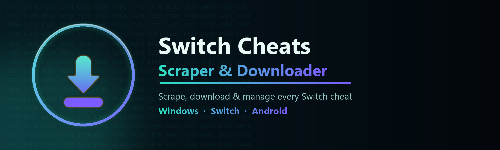

  

  
  
  

<b>by DevCatSKZ</b>

**Scrape, download and manage Nintendo Switch cheat codes** from CheatSlips.com, GBATempArchive and more. All in one Windows app with a searchable database and one-click export to your Switch SD card (Atmosphère / Breeze / EdiZon) or a ZIP.

---

## ⬇️ Download

Grab the latest build from **[Releases »](../../releases/latest)**

| | |
|---|---|
| **Installer** — `SwitchCheatsScraper-Setup.exe` | Classic per-user install with Start-menu & desktop shortcut. |
| **Portable** — `SwitchCheatsScraper-portable.zip` | Just unzip and run `SwitchCheatsScraper.exe`. Data stays next to the app. |

## ⭐ Get everything in one click

Skip the scraping entirely. The **“Get Everything from DevCatSKZ Github Repo”** panel downloads a ready-made **cheats archive** and the **complete database** straight from this repo and imports them for you.

## ✨ What it does

- **Many sources in one tool** — cheatslips.com (scrape + official API) plus GBATempArchive, HamletDuFromage (+60FPS/Res/GFX), Sthetix, Breeze, Chansey, MyNXCheats, ibnux and titledb. Cheats are merged per build, so nothing is ever lost.
- **Searchable database** with covers, regions, versions and descriptions — find any title by name, Title ID or Build ID.
- **Export to SD card** in exactly the layout Atmosphère / Breeze / EdiZon expect (drive auto-detect), or to a ZIP. **Import/Export the whole database** too.
- **Robust browser fallback** (Playwright) for cheats the API won’t hand out, with automatic login handling and quota reset.
- **Dark mode by default** with a one-click light/dark toggle across the entire program.

## 🔒 Note

Use this tool only with your **own** CheatSlips account, and respect each source’s terms. All cheat codes belong to their original authors and uploaders.

---

<b>Switch Cheats Scraper & Downloader</b> · Version 1.0 · © DevCatSKZ

